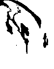

Calculation of the swaying behavior of Phyllothelys werneri  
=
Here's the behavior:  
  

Step 1:  
-
The original video was transformed into binary images. The sticks and mantis can be seen clearly this time.  
  

Step 2:  
-
I marked some significant points using MATLAB to take apart the moving parts with static ones.  

Step 3:
-

  
Explanation of the files:  
-
    gif.m             transforms the images into a gif  
    video.m           transforms the images into a video  
    ws_main.m         extracts the main points of the mantis  
    ws_calc.m         calculates the data  
    location.mat      the main points of the mantis  
    cfit_Fourier.mat  the results calculated by cftool  

